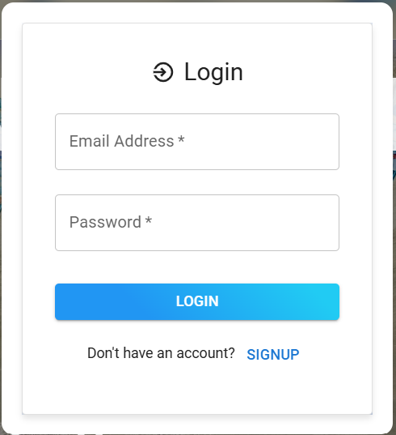
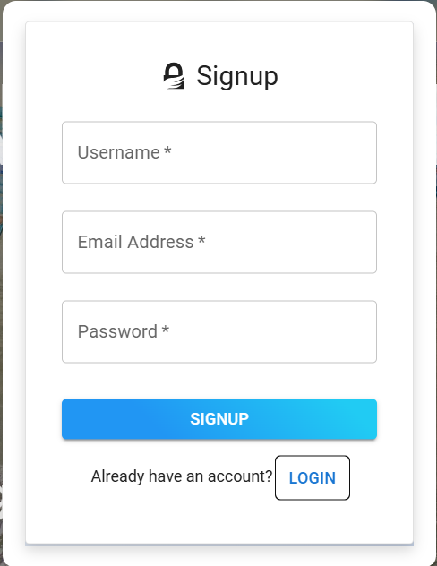
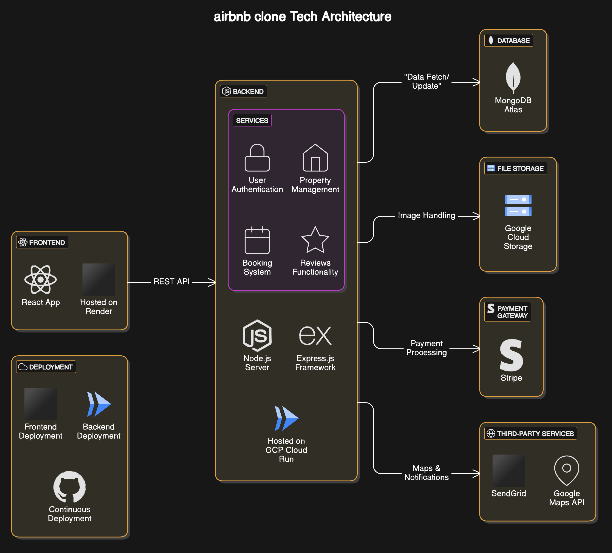

# Airbnb Clone Travel Website

## Project Overview

The Airbnb Clone Travel Website is a full-stack web application developed as part of the MERN stack development program. This project aims to replicate key functionalities of Airbnb, enabling users to explore and book travel accommodations. The application is built using React, Vite, Material UI, Node.js, Express.js, and MongoDB.

---

## Table of ontents

- [Features](#features)
- [Tech Stack](#tech-stack)
- [Installation](#installation)
- [Usage](#usage)
- [Folder Structure](#folder-structure)
- [Screenshots](#screenshots)
- [Future Enhancements](#future-enhancements)
- [License](#license)

---

## Features

- **User Authentication**: Secure login and signup using JSON Web Tokens (JWT).
- **Property Listings**: View and filter properties based on location, price, and availability.
- **Booking System**: Book properties for specified dates and manage bookings.
- **User Profiles**: View and edit user details and booking history.
- **Responsive Design**: Optimized for desktop and mobile devices.

---

## Tech Stack

### Frontend

- [React](https://reactjs.org/) - JavaScript library for building user interfaces.
- [Vite](https://vitejs.dev/) - Fast build tool for modern web projects.
- [Material UI](https://mui.com/) - React component library for building user-friendly interfaces.
- [React Router](https://reactrouter.com/) - Routing library for navigation.

### Backend

- [Node.js](https://nodejs.org/) - JavaScript runtime for building server-side applications.
- [Express.js](https://expressjs.com/) - Web framework for building APIs.
- [MongoDB](https://www.mongodb.com/) - NoSQL database for data storage.

### Tools

- [Axios](https://axios-http.com/) - HTTP client for API calls.
- [JWT](https://jwt.io/) - Token-based authentication.
- [BCrypt.js](https://github.com/kelektiv/node.bcrypt.js) - Password hashing library.

---

## Installation

### Prerequisites

- Node.js and npm installed.
- MongoDB instance running locally or in the cloud.

### Steps

1. Clone the repository:
   ```bash
   git clone https://github.com/muzammil-13/airbnb-clone.git
   cd airbnb-clone
   ```
2. Set up the backend:
   ```bash
   cd backend
   npm install
   ```
3. Set up the frontend:
   ```bash
   cd frontend
   npm install
   ```
4. Configure environment variables:
   - Create a `.env` file in the `server` directory and add:
     ```
     PORT=5000
     MONGO_URI=your-mongodb-uri
     JWT_SECRET=your-secret-key
     ```
5. Run the application:
   - Start the backend:
     ```bash
     cd backend
     npm run dev
     ```
   - Start the frontend:
     ```bash
     cd frontend
     npm run dev
     ```
6. Open the application in your browser at `http://localhost:5173`.

---

## Usage

- **Sign Up**: Create a new account.
- **Log In**: Access your account using email and password.
- **Explore Properties**: Browse properties and apply filters.
- **Book Properties**: Reserve properties for specific dates.
- **View Profile**: Check your booking history and manage your details.

---

## Folder Structure

```plaintext
project/
├── frontend/
│   ├── public/
│   ├── src/
│   │   ├── components/
│   │   ├── pages/
│   │   ├── App.jsx
│   │   ├── index.js
│   ├── package.json
├── backend/
│   ├── models/
│   ├── routes/
│   ├── server.js
│   ├── package.json
├── .gitignore
├── README.md
```

---

## Screenshots

[Demo: Logo]


[Demo: Landing page]


[Demo: Authentication]

Login:



Signup:



---

## Future Enhancements

- **Payment Integration**: Add a payment gateway for bookings.
- **Property Reviews**: Allow users to leave reviews and ratings.
- **Admin Dashboard**: Manage property listings and bookings.

[Demo: Tech Architecture with Future implementions]



---

## License

This project is licensed under the MIT License. See the LICENSE file for details.
