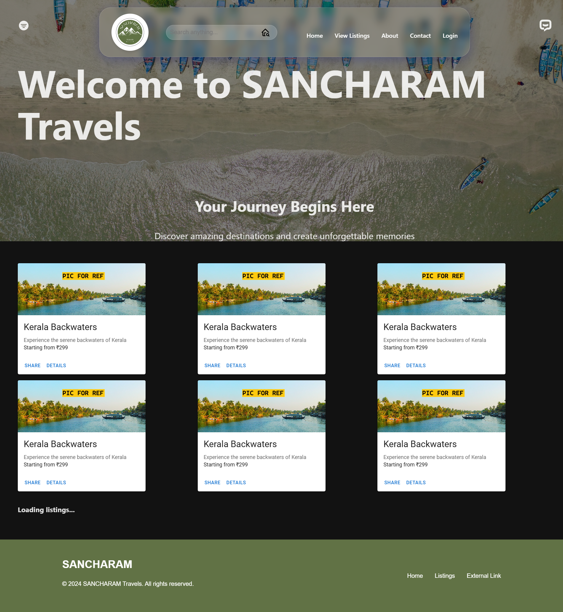

# Airbnb Clone Travel Website

## Project Overview

A modern full-stack travel booking platform built with the MERN stack. This application delivers a seamless user experience for exploring and booking accommodations, complete with real-time chat support and interactive features.

## Table of Contents

- [Project Overview](#project-overview)
- [Key Features](#key-features)
- [Tech Stack](#tech-stack)
  - [Frontend](#frontend)
  - [Backend](#backend)
- [Getting Started](#getting-started)
  - [Prerequisites](#prerequisites)
  - [Installation](#installation)
- [Usage](#usage)
- [Folder Structure](#folder-structure)
- [Features in Detail](#features-in-detail)
  - [Smart Search System](#smart-search-system)
  - [Real-time Chat Support](#real-time-chat-support)
  - [Booking System](#booking-system)
- [Screenshots](#screenshots)
- [Future Enhancements](#future-enhancements)
- [Contributing](#contributing)
- [License](#license)

## Key Features

- **Smart Search System**: Location-based property search with interactive filters
- **Real-time Chat Support**: WebSocket-powered FAQ bot for instant assistance
- **User Authentication**: Secure JWT-based authentication system
- **Interactive Booking**: Streamlined booking process with date selection
- **Responsive Design**: Optimized experience across all devices

## Tech Stack

### Frontend

- React + Vite for lightning-fast development
- Material UI for polished components
- WebSocket integration for real-time features
- Environment-based configuration

### Backend

- Node.js + Express for robust API handling
- MongoDB for flexible data storage
- WebSocket server for chat functionality
- JWT for secure authentication

## Getting Started

### Prerequisites

- Node.js
- MongoDB
- npm or yarn

### Installation

1. Clone the repository:

   ```bash
   git clone https://github.com/muzammil-13/airbnb-clone.git
   cd airbnb-clone
   ```
2. Set up the backend:

   ```bash
   cd backend
   npm install
   npm run dev
   ```
3. Set up the frontend:

   ```bash
   cd frontend
   npm install
   npm run dev
   ```
4. Configure environment variables:

   - Create a `.env` file in the `frontend` directory and add:
     ```
     VITE_API_URL=http://localhost:3000
     ```
   - Create a `.env` file in the `backend` directory and add:
     ```
     PORT=3000
     MONGO_URI=mongodb://localhost:27017/
     JWT_SECRET=your_jwt_secret
     CLIENT_URL=http://localhost:5173
     ```
5. Run the application:

   - Start the backend:
     ```bash
     cd backend
     npm run dev
     ```
   - Start the frontend:
     ```bash
     cd frontend
     npm run dev
     ```
6. Open the application in your browser at `http://localhost:5173`.

---

## Usage

- **Sign Up**: Create a new account.
- **Log In**: Access your account using email and password.
- **Explore Properties**: Browse properties and apply filters.
- **Book Properties**: Reserve properties for specific dates.
- **View Profile**: Check your booking history and manage your details.

---

## Folder Structure

```plaintext
project/
├── backend/
│   ├── config/
│   ├── controllers/
│   ├── models/
│   ├── routes/
│   ├── services/
│   ├── server.js
│   └── package.json
├── frontend/
│   ├── public/
│   ├── src/
│   │   ├── components/
│   │   ├── pages/
│   │   ├── styles/
│   │   ├── App.js
│   │   ├── index.js
│   │   └── package.json
├── .gitignore
└── README.md
```

---

## Features in Detail

### Smart Search System

- Location-based filtering
- Price range selection
- Date availability checking
- Interactive map integration

### Real-time Chat Support

- Instant response FAQ bot
- Keyword suggestions
- Persistent chat history
- Automatic reconnection

### Booking System

- Interactive calendar
- Real-time availability
- Instant confirmation
- Booking management

---

## Screenshots

[Demo: Logo]


[Demo: Landing page]



[Demo: Authentication]

Login:


Signup:


---

## Future Enhancements

- **Payment Integration**: Add a payment gateway for bookings.
- **Property Reviews**: Allow users to leave reviews and ratings.
- **Admin Dashboard**: Manage property listings and bookings.
- **Host Dashboard**: Manage property listings and bookings.
- **Advanced Search Filters**: Add more filters for property search.
- **Mobile Applications**: Develop mobile apps for iOS and Android.

[Demo: Tech Architecture with Future implementations]


---

## Contributing

Contributions are welcome! Feel free to submit pull requests or open issues for improvements.

---

## License

This project is licensed under the MIT License. See the LICENSE file for details.
